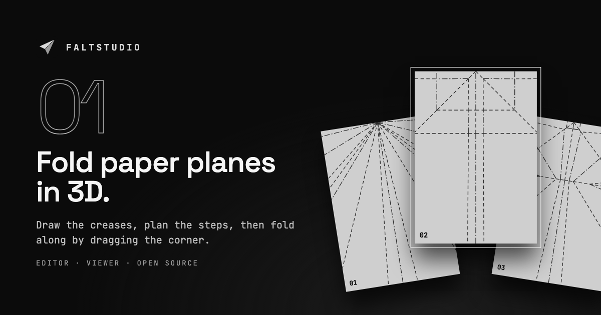

<p align="center">
  
</p>

<h1 align="center">Faltstudio</h1>

<p align="center">
  <b>Fold paper planes in 3D, step by step — and build the guides in an editor.</b>
</p>

<p align="center">
  <a href="https://heartcoders.github.io/faltstudio/"></a>
  <a href="https://github.com/heartcoders/faltstudio/actions/workflows/pages.yml"></a>
  <a href="LICENSE"></a>
  
  
  
  
  
</p>

<p align="center">
  <a href="https://heartcoders.github.io/faltstudio/"><b>Try it</b></a> ·
  <a href="docs/embedding.md">Embed the viewer</a> ·
  <a href="#getting-started">Getting started</a>
</p>

<p align="center">
  
</p>

---

Faltstudio is rigid origami in the browser: the sheet breaks into rigid faces
along its creases, and every fold is a rotation about an axis in the current
folded state. You fold along in a 3D viewer by dragging a corner, and you author
the guides in an editor — from a photo of an unfolded plane or by drawing the
creases directly.

## Features

- **Fold along in 3D** — drag the corner until it snaps, or let the viewer
  demonstrate the step. The next crease stays sharp while everything else fades
  back.
- **Editor** — rectify a photo, draw lines with snapping and symmetry, plan the
  steps with a dial, preview the whole sequence, and check flat-foldability
  (Maekawa, Kawasaki) as you go.
- **Mobile first** — sheets and toolbars in thumb reach, a loupe above your
  finger while drawing, pinch to zoom.
- **Share without a backend** — the whole model travels in the link
  (`view.html#m=…`), with a QR code for short ones.
- **Embeddable** — `<fl-viewer>` drops into any page, see
  [docs/embedding.md](docs/embedding.md).
- **German and English UI** — follows the browser, switchable at any time.
- **Blueprint design** — strictly black and grey; states are shown through
  brightness, stroke weight, dash pattern and inversion, never colour.

## Packages

| Package              | Contents                                                                                         |
| -------------------- | ------------------------------------------------------------------------------------------------ |
| `@faltstudio/core`   | Geometry, fold engine, validation, file format, store. No DOM; three.js only under `core/three`. |
| `@faltstudio/ui`     | Lit components in the blueprint design (`fl-button`, `fl-dial`, `fl-scene`, …), tokens, i18n.    |
| `@faltstudio/editor` | The studio: start page, editor (photo, lines, steps, preview, JSON/FOLD) and the viewer page.    |
| `@faltstudio/viewer` | The viewer `<fl-viewer>`: as a page or embedded, folding by dragging.                            |

## Getting started

```sh
pnpm install
pnpm dev            # studio on :5173 (start, editor, viewer page), viewer development on :5174
pnpm test           # core (Node), UI and viewer (Chromium), editor
pnpm typecheck && pnpm lint && pnpm format:check
pnpm build
```

The UI and viewer tests run in Vitest's browser mode; install Chromium once with
`npx playwright install chromium` in `packages/ui`.

## The studio

- `/` — start page: your models and the bundled examples as a fan of paper
  sheets. Tap a sheet to fold it along, edit it, start a new one or open a file.
- `/editor.html?model=…` · `?example=…` · `?new` — the editor. It saves
  continuously to the local library (IndexedDB); examples are never
  overwritten, you always edit a copy.
- `/view.html?model=…` — the viewer, with links back home and to the editor.

Below 48 rem (phones) the studio switches to the mobile layout: toolbar and
sheets at the bottom, file and findings as sheets. While drawing, a loupe aims
60 px above your finger and the point is set when you lift it; two fingers zoom
and pan.

All three pages share one origin, otherwise they would not see the same
library. Without a backend, models stay in your browser. To pass one on, use
_Done · Share · QR code_ (also in the ⋯ card menu and under _File_): the link
`view.html#m=…` contains the whole model, compressed (deflate-raw, base64url),
without the photo. The fragment never reaches a server. Whoever opens the link
sees the guide; _Edit_ creates their own copy in their library. Up to about
2.9 kB the link fits into a QR code, beyond that you only get the link.

## Examples

`examples/*.json` holds three classic planes on A4: the **Dart** (8 steps), the
**Hammerhead** (8 steps) and the **Nakamura Lock** (10 steps). The files are
generated, not maintained by hand:

```sh
pnpm --filter @faltstudio/core example:dart     # dart-a4.json
pnpm --filter @faltstudio/core example:planes   # hammerkopf-a4.json, nakamura-a4.json
```

Each fold is described as a line on the folded plane and traced through every
layer it crosses, so every layer gets its own crease segment and the pattern
stays flat-foldable. Mountain and valley come from the final folded state. A
test checks that every bundled example folds without findings.

Favicons, app icons and the social preview image in `packages/editor/public` are
generated as well: `pnpm --filter @faltstudio/editor meta-images`.

## More

- [Embedding the viewer](docs/embedding.md)

## License

[MIT](LICENSE) © 2026 Philipp Jordan (heartcoders)
